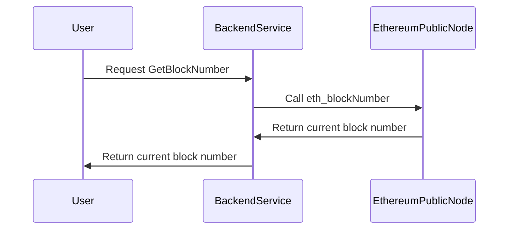
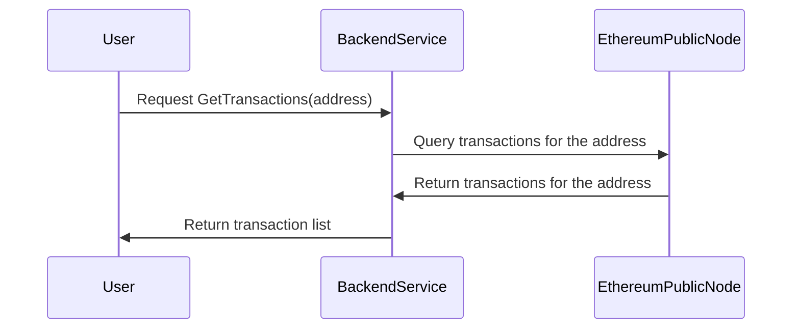
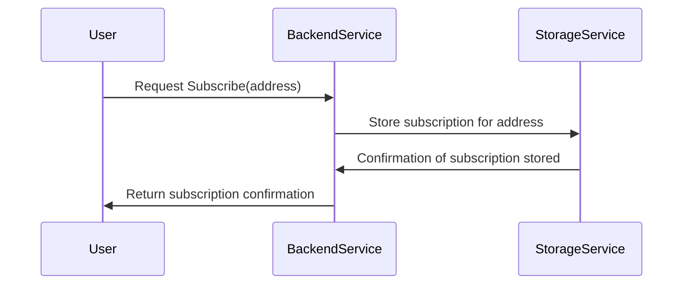
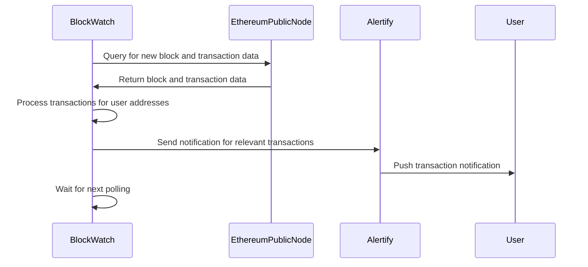
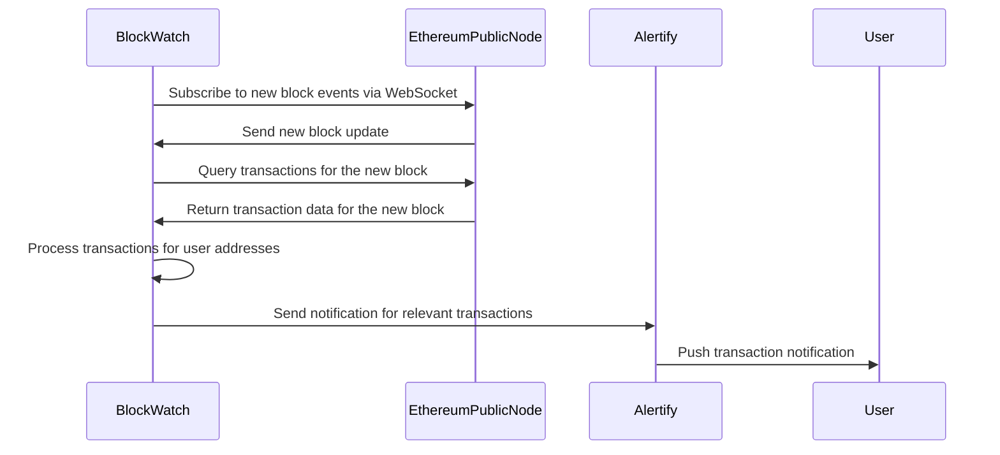

# **BlockWatch Project**

**BlockWatch** is a real-time monitoring service for Ethereum transactions. It interacts with Ethereum public nodes to fetch transaction data, and allows users to subscribe to specific addresses to receive transaction notifications.

## **Components Overview**

### 1. **BlockWatch**:
   - The core service that handles requests from users, processes them, and interacts with Ethereum, Storage, and Notification services.
   
### 2. **Ethereum Public Node**:
   - A public Ethereum node that provides real-time data from the blockchain, including transaction data and block numbers.
   - BlockWatch queries this node to get the latest blockchain information.

### 3. **Mock Notification Service (Alertify)**:
   - A mock service to simulate the sending of notifications to users about incoming or outgoing transactions related to subscribed addresses.
   - It listens to BlockWatch to notify users based on the latest transaction data.

### 4. **Storage Service**:
   - Local storage service for saving subscription data (in-memory or persistent storage like Redis).
   - Handles storing and retrieving the list of addresses that users are subscribed to for transaction notifications.

---

## **Data Flow and Interaction**

1. **Request for Transactions**:
   - The **User** requests transaction data for a specific address from **BlockWatch**.
   - **BlockWatch** queries **EthereumNode** for transactions related to the given address.
   - **EthereumNode** returns transaction data, and **BlockWatch** sends it back to the **User**.

2. **Subscription**:
   - The **User** subscribes to notifications for an address, which is stored by **BlockWatch** in **Storage Service**.
   - **Storage Service** confirms the subscription and returns a success message to **BlockWatch**, which then sends a confirmation back to the **User**.

3. **Notification**:
   - **BlockWatch** triggers **Alertify** to send push notifications to the user when an incoming or outgoing transaction occurs for a subscribed address.
   - **Alertify** sends a notification response back to **BlockWatch**, confirming the notification was sent.

---

## **Sequence Diagrams**

### 1. **GetBlockNumber Sequence Diagram**:

### 2. **GetTransactions Sequence Diagram**:

### 3. **Subscribe Sequence Diagram**:

## **Polling vs. Listening: Sequence Diagrams**

In this model, BlockWatch polls the Ethereum public node at intervals, processes new transactions, and notifies users via the Alertify Service.

---

### **Listening Option with Alertify Service**:
In this model, BlockWatch establishes a WebSocket connection to the Ethereum public node for real-time updates. Upon receiving new block information, it processes transactions and notifies users via the Alertify Service.

---

### **Explanation of the Flow**:
1. **Polling**:
   - BlockWatch polls the Ethereum public node at regular intervals to fetch new blocks and their transactions.
   - It processes the transactions, compares them to the stored subscriptions, and identifies which users need to be notified.
   - BlockWatch sends the notification details to Alertify, which pushes the notifications to the respective users.

2. **Listening**:
   - BlockWatch establishes a WebSocket connection to the Ethereum public node to listen for real-time block updates.
   - When a new block is added, BlockWatch fetches its transactions, processes them, and identifies which users need notifications.
   - The notifications are sent to Alertify, which delivers them to the users.

### **Key Points**:
- **Alertify Service** handles the actual delivery of notifications to users, separating the notification logic from BlockWatch.
- This architecture avoids direct communication between users and BlockWatch, enabling a streamlined and event-driven notification system.
- **Listening** is more efficient for real-time notifications compared to **Polling**, which is better suited for environments without WebSocket support.
### **Reference:**
- [Ethereum Execution APIs](https://github.com/ethereum/execution-apis)

