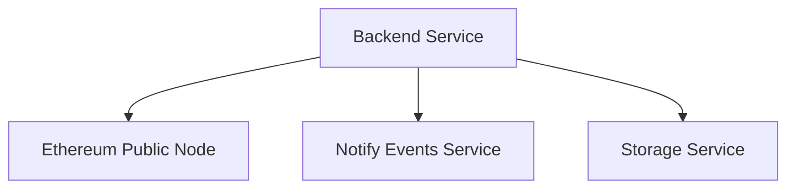
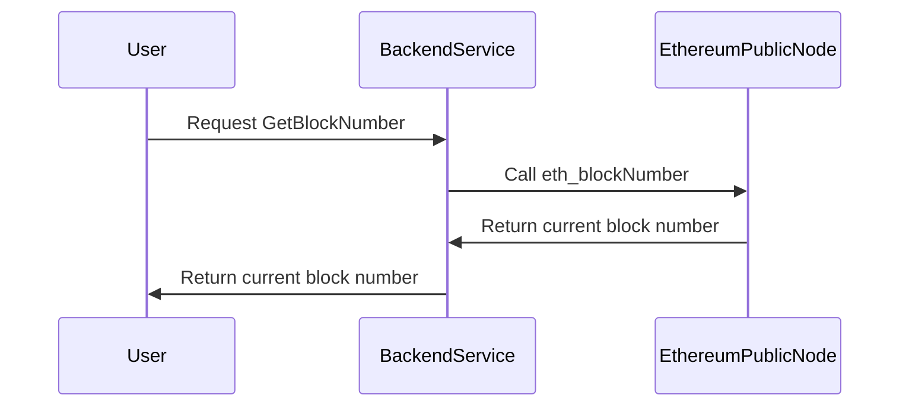
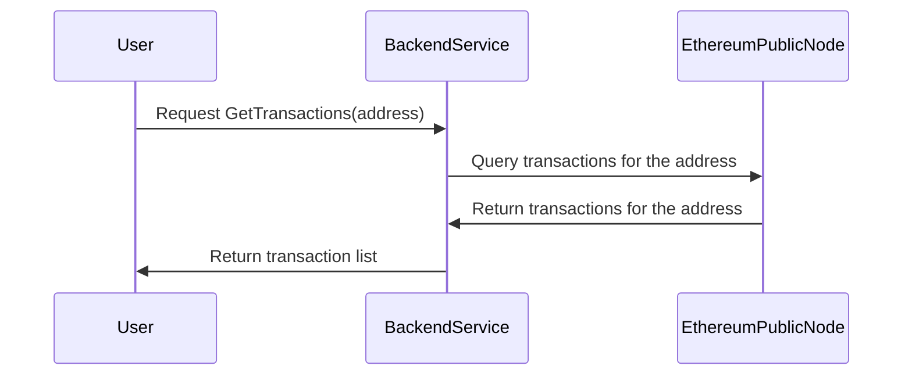
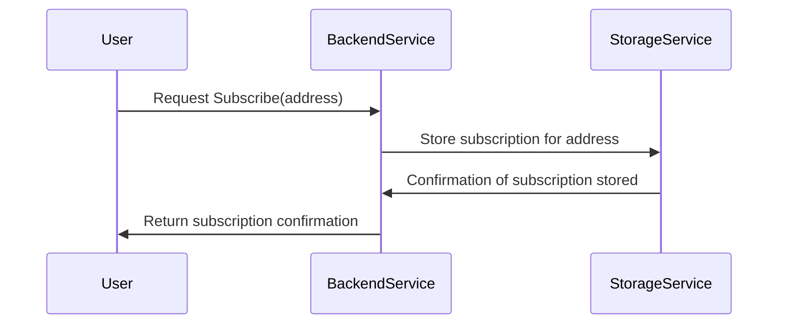

1. **Backend Service** (tech-sensitive name, e.g., "HeroCore")
2. **Ethereum Public Node** (tech-sensitive name, e.g., "EtherealNode")
3. **Mock Notification Service** (tech-sensitive name, e.g., "Alertify")
4. **Storage Service** (tech-sensitive name, e.g., "VaultStore")

### Mermaid Code for Architecture Diagram:

### Explanation of Components:

1. **HeroCore (Backend Service)**:
   - The main service that handles requests from users, processes them, and interacts with other systems like Ethereum, Storage, and the Notification Service.
   
2. **EtherealNode (Ethereum Public Node)**:
   - A public Ethereum node that provides real-time data from the blockchain, including transaction data and block numbers.
   - The Backend Service queries this node to get the latest blockchain information.

3. **Alertify (Mock Notification Service)**:
   - A mock service to simulate the sending of notifications to users about incoming or outgoing transactions related to subscribed addresses.
   - It listens to the Backend Service to notify users based on the latest transaction data.
   
4. **VaultStore (Storage Service)**:
   - The local storage service where subscriptions are stored.
   - This service handles storing and retrieving the list of addresses that users want to subscribe to for transaction notifications.

### Data Flow:

1. **Request for Transactions**:
   - The **User** requests transaction data for a specific address from **HeroCore**.
   - **HeroCore** queries **EtherealNode** for transactions related to the given address.
   - **EtherealNode** returns transaction data, and **HeroCore** sends it back to the **User**.

2. **Subscription**:
   - The **User** subscribes to notifications for an address, which is stored by **HeroCore** in **VaultStore**.
   - The storage confirms the subscription and returns a success message to **HeroCore**, which then sends a confirmation back to the **User**.

3. **Notification**:
   - **HeroCore** triggers **Alertify** to send push notifications to the user when an incoming or outgoing transaction occurs for a subscribed address.
   - **Alertify** sends a notification response back to **HeroCore**, confirming the notification was sent.

### 1. **GetBlockNumber Sequence Diagram**:

**Explanation**:
- The user requests the current block number from the backend service.
- The backend service sends a request to the Ethereum public node via the `eth_blockNumber` method.
- The Ethereum public node responds with the latest block number.
- The backend service returns the block number to the user.

---

### 2. **GetTransactions Sequence Diagram**:

**Explanation**:
- The user requests transaction data for a specific address.
- The backend service queries the Ethereum public node for transactions related to the specified address.
- The Ethereum public node returns the transaction data.
- The backend service sends the transaction list back to the user.

---

### 3. **Subscribe Sequence Diagram**:

**Explanation**:
- The user requests to subscribe to notifications for a specific address.
- The backend service stores the subscription in the storage service (in-memory or a database).
- The storage service confirms that the subscription has been successfully stored.
- The backend service sends a confirmation response to the user, indicating that they are now subscribed to notifications.

